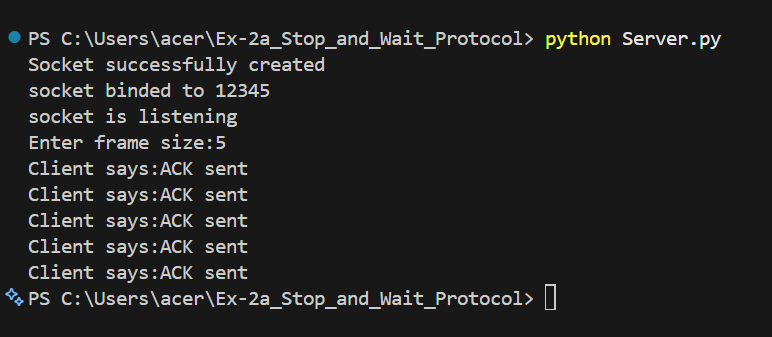
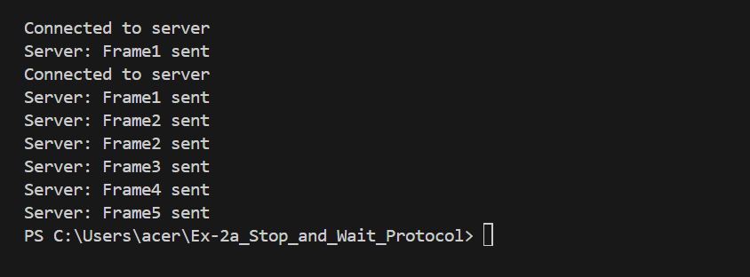

# 2a_Stop_and_Wait_Protocol
## AIM 
To write a python program to perform stop and wait protocol
## ALGORITHM
1. Start the program.
2. Get the frame size from the user
3. To create the frame based on the user request.
4. To send frames to server from the client side.
5. If your frames reach the server it will send ACK signal to client
6. Stop the Program
## PROGRAM
### Client.py
```
import socket
client_socket = socket.socket(socket.AF_INET, socket.SOCK_STREAM)
client_socket.connect(("127.0.0.1", 12345  ))
print("Connected to server")

while True:
    recvie = client_socket.recv(1024).decode()
    if recvie == "Exit":
        break

    print("Server:", recvie)
    message = "Client says:ACK sent"
    client_socket.send(message.encode())
client_socket.close()

```
### Server.py
```
import socket             
s = socket.socket()         
print ("Socket successfully created")
port = 12345                
s.bind(('', port))         
print ("socket binded to %s" %(port)) 
s.listen(5)     
print ("socket is listening")    
c, addr = s.accept() 
frame=int(input("Enter frame size:")) 
for i in range(1,frame+1):
    send=f"Frame{i} sent"
    c.send(send.encode())
    msg = c.recv(1024).decode()
    print(msg)
send="Exit"
c.send(send.encode())
c.close()

```
## OUTPUT


## RESULT
Thus, python program to perform stop and wait protocol was successfully executed.
